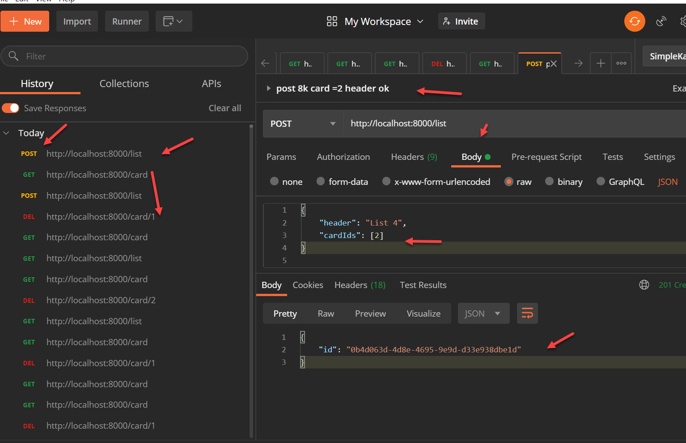

## >> App Name:

Trelloyes-Server--Express-drill

## >> APP Summary:
This project builds an Express Server with a secured API endpoint so that it can be safely opened to the public, it uses Express Router API so the endpoint will support id for data manipulation of the 'database'.An in-memory array-based list and card items were used as the 'database' for this project.

this project get the starter code via Project [express-boilerplate](https://github.com/davetam88/express-boilerplate)

Error handling/reporting will be via an info.log file facilitate with the Winston logging library middleware and the response code/message..

The server code was refactored via layering(vertically) and modularizing(horizontally) techniques and further modularizing was possible with the help of the Express router. 

Note that endpoint only responds when given a valid Authorization header with a Bearer API token value. You can use the following page link to generate one  :
[UUID generator](https://www.uuidgenerator.net/version1)

Once it's generated, place the UUID string inside a .env file along with the NODE_ENV and server port number, similar to the following example.
```
NODE_ENV=development 
PORT=8000
API_TOKEN=YOUR-UUID
```

The endpoint supported are : 
```
GET /card
GET /list
POST /card
POST /list
GET /card/:id
GET /list/:id
DELETE /card/:id
DELETE /list/:id
```

The GET /card and GET /list endpoints return arrays of cards and lists respectively and POST /card and POST /list endpoint will allow users to add a card and list to the database respectively. Use DELETE /card/:id to delete a card and DELETE /list/:id to delete a list object.

the sample format for the list and card data is as follows:
```
lists data format 
  {
    id: 1,
    header: 'List 1',
    cardIds: [1,2]
  }

Card data format 
  {
    id: 1,
    title: 'Task 1',
    content: 'This is card 1'
  }
```

## >> Screenshots

Post query with Authorization header



## >> Technologies used in this APP:

* Express Server
* app.get API
* Express middleware
* API tokens
* Authorization headers
* doenv (for the .env API authehitic key file)
* CORS
* Helmet
* Winston logging library
* morgan loggging tool

-> Javascript: ES6

-> Tools
* Postman
`* VSC Debugger
* nodemon 
* NPM


## >> [Github Link](https://github.com/davetam88/Trelloyes-Server--Express-drill)


